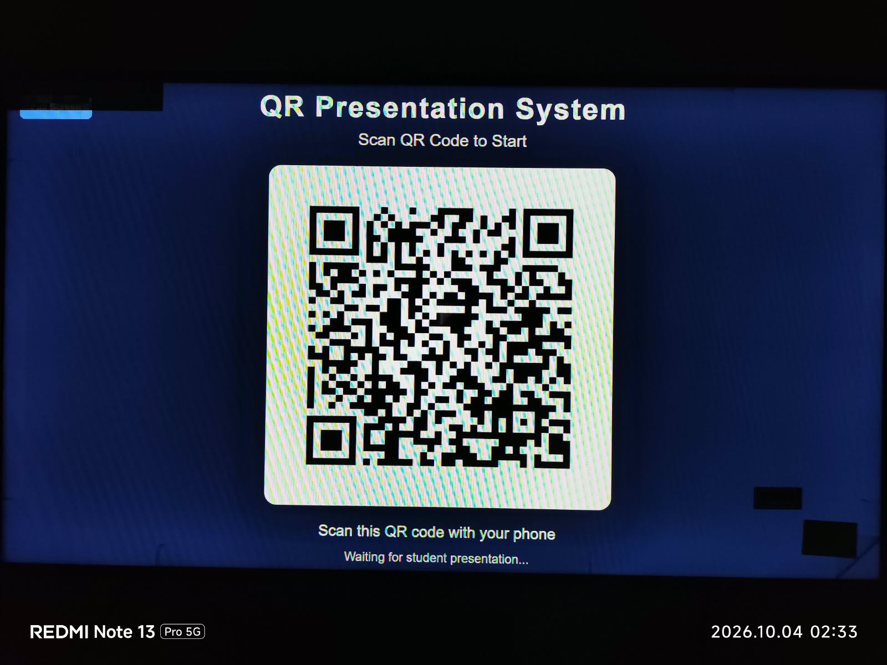
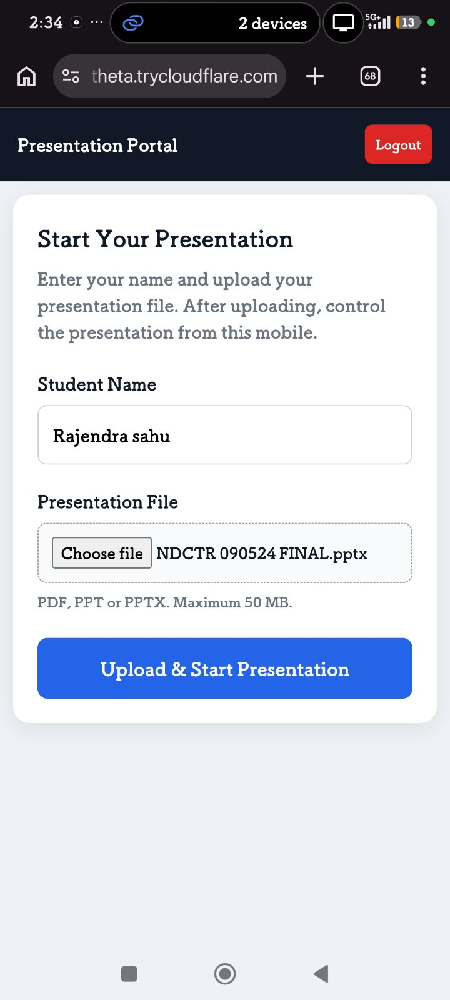
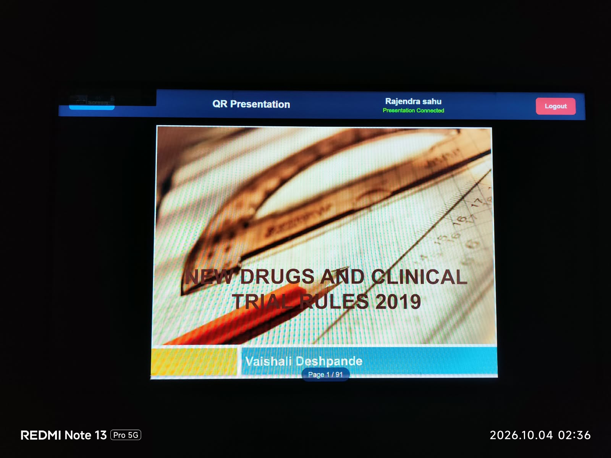
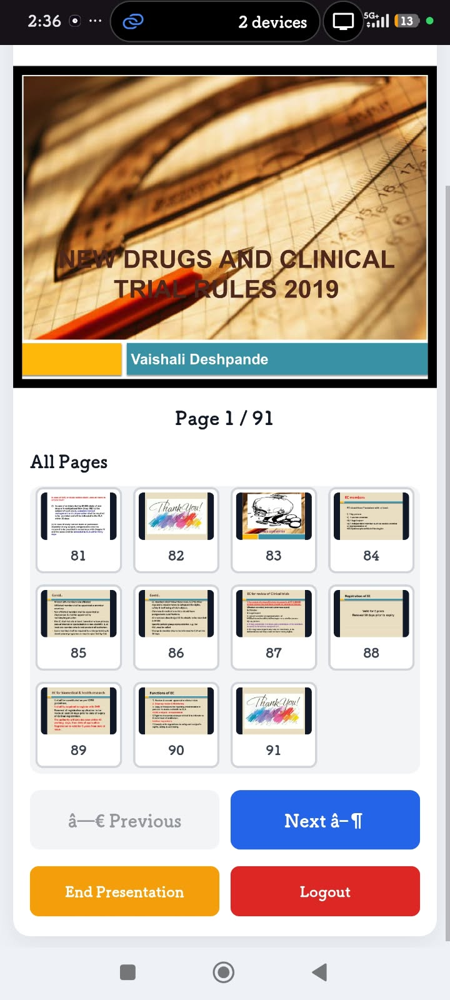

# QR Presentation System

A QR-based classroom presentation system that allows students to upload PDF, PPT, and PPTX presentations from a mobile device and control the presentation from the main computer.

## Features

- QR code based student connection
- Upload presentations from mobile
- PDF, PPT and PPTX support
- Automatic PPT/PPTX to PDF conversion
- Main screen presentation display
- Mobile presentation control
- Next / Previous slide navigation
- Click any thumbnail to open a slide
- Synchronized mobile and main presentation view
- Student name display
- 50 MB upload limit
- Temporary session-based file handling
- Cloudflare Quick Tunnel support
- Windows EXE packaging support

## How It Works

1. Run the QR Presentation System on the main computer.
2. A QR code is displayed on the main screen.
3. Student scans the QR code using a mobile phone.
4. Student enters their name.
5. Student uploads a PDF, PPT or PPTX file.
6. The presentation is prepared automatically.
7. The presentation appears on the main computer.
8. The student can control the presentation from the mobile device.

## Requirements

- Windows
- Python 3.12+
- Flask
- PyMuPDF
- Pillow
- qrcode
- pypdf
- python-pptx
- LibreOffice for PPT/PPTX conversion

Maximum upload size: 50 MB.

## Supported Files

- PDF
- PPT
- PPTX

## Installation

Clone the repository:

    git clone https://github.com/hacker-mindset/QR-Presentation-System.git
    cd QR-Presentation-System

Create a virtual environment:

    python -m venv venv

Activate the virtual environment:

    .\venv\Scripts\Activate.ps1

Install dependencies:

    pip install -r requirements.txt

Run the application:

    python app.py

## PPT/PPTX Support

PPT and PPTX files are converted to PDF using LibreOffice.

LibreOffice must be installed on the computer when PPT/PPTX files are used.

PDF files do not require LibreOffice.

## Project Structure

    QR-Presentation-System/
    |
    +-- app.py
    +-- requirements.txt
    +-- QR_Presentation_System.spec
    +-- .gitignore
    |
    +-- templates/
    |   +-- main.html
    |   +-- student.html
    |
    +-- static/
        +-- css/
            +-- style.css

## Privacy

Uploaded presentations are handled as temporary session data and are not intended to be stored permanently.

## Author

Rajendra Sahu

## License

This project is currently shared for learning and portfolio purposes.

## Screenshots

### Main QR Screen

### Mobile Upload

### Main Presentation

### Mobile Presentation Control

